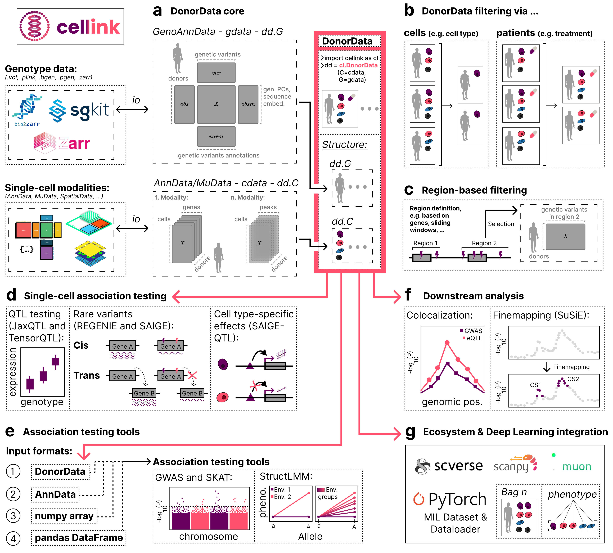

<!-- logo-image-start -->

<p align="center">
  
</p>

<!-- logo-image-end -->

[](https://github.com/theislab/cellink/actions/workflows/build.yaml/badge.svg)
[](https://opensource.org/licenses/Apache2.0)
[](https://cellink-docs.readthedocs.io/)
[](https://github.com/theislab/cellink/actions/workflows/test.yaml)
[](https://github.com/pre-commit/pre-commit)

# cellink: a framework for joint analysis of genotype and single-cell data

Single-cell profiles are indexed by cell; genotype data is indexed by donor. Keeping the two
correctly paired through subsetting and filtering is easy to get wrong by hand, and each
downstream genetics tool (PLINK, MAGMA, LDSC, TensorQTL, SAIGE-QTL, and more) expects its own
file formats and conventions. **cellink** provides a single `DonorData` structure that keeps
donor- and cell-level data synchronized, and the glue to drive that surrounding tool
ecosystem directly from it.

## Key Features

### 1. Unified `DonorData` structure

**cellink** introduces the `DonorData` class, unifying individual-level and single-cell data. It extends standard formats (AnnData, MuData) with GenoAnnData for efficient genotype (via dask) and phenotype (via ehrapy) handling.

<!-- schematic-image-start -->



<!-- schematic-image-end -->

- **Donor-level Data (G):** `GenoAnnData`, Stores individual level data such as genotypes.
- **Cell-level Data (C):** `AnnData`/ `MuData`, Stores single-cell omics data such as gene expression.

Crucially, **`DonorData`** ensures that genetic data and single-cell modalities remain **synchronized**, preserving their donor-cell pairing even through complex filtering operations (e.g., selecting specific cell types or patient subsets). See the [`DonorData` on-disk format](https://cellink-docs.readthedocs.io/en/latest/donordata_format_spec.html) for how this is represented on disk and how to check a `DonorData` object against it.

### 2. Comprehensive toolkit

**cellink** offers a streamlined suite of tools for the entire analysis workflow, organized by task:

**Association testing**
- [eQTL analysis with jaxQTL or tensorQTL](https://cellink-docs.readthedocs.io/en/latest/tutorials/pseudobulk_eqtl_jaxqtl_tensorqtl.html)
- [eQTL analysis with SAIGE-QTL](https://cellink-docs.readthedocs.io/en/latest/tutorials/single_cell_eqtl_saigeqtl.html)
- [Naive pseudobulk eQTL mapping](https://cellink-docs.readthedocs.io/en/latest/tutorials/pseudobulk_eqtl.html)
- [Rare variant association studies](https://cellink-docs.readthedocs.io/en/latest/tutorials/burden_testing.html)
- [Clumping & pruning](https://cellink-docs.readthedocs.io/en/latest/tutorials/clumping_pruning.html)
- [Colocalization analysis](https://cellink-docs.readthedocs.io/en/latest/tutorials/colocalization.html)
- [Resolving association-test inputs directly from `DonorData` via formula strings](https://cellink-docs.readthedocs.io/en/latest/tutorials/formula_resolver.html)

**Heritability, gene programs & GWAS integration**
- [Cell-type specific LD score regression](https://cellink-docs.readthedocs.io/en/latest/tutorials/cell_level_ldsc_analysis.html)
- [Gene program scoring with sc-linker](https://cellink-docs.readthedocs.io/en/latest/tutorials/sclinker.html)
- [Gene-set enrichment with MAGMA](https://cellink-docs.readthedocs.io/en/latest/tutorials/magma_analysis_tutorial.html)
- [Integrating GWAS with single-cell disease relevance scores (scDRS/seismic)](https://cellink-docs.readthedocs.io/en/latest/tutorials/scdrs_seismic.html)
- [Integrating GWAS with spatial data (gsMap)](https://cellink-docs.readthedocs.io/en/latest/tutorials/gsmap.html)

**Deep learning & representation learning**
- [LIVI: donor-level representation learning](https://cellink-docs.readthedocs.io/en/latest/tutorials/livi.html)
- [Scooby: single-cell-resolution sequence-to-coverage modeling & variant scoring](https://cellink-docs.readthedocs.io/en/latest/tutorials/scooby.html)
- [Built-in dataloaders for deep learning](https://cellink-docs.readthedocs.io/en/latest/tutorials/run_dataloader.html), including Multiple Instance Learning (MIL) over per-donor cell bags

**Other**
- [Variant preprocessing & annotation](https://cellink-docs.readthedocs.io/en/latest/tutorials/explore_annotations.html): quality control, annotation (VCF export/import), and selection of genetic variants.
- [Integrating `DonorData` with EHR data](https://cellink-docs.readthedocs.io/en/latest/tutorials/ehrdataset.html)

## Getting Started

Install the latest development version directly from GitHub (cellink is not yet published
on PyPI; a future release will be published as `cellink-tools`, see the
[installation guide](https://cellink-docs.readthedocs.io/en/latest/installation.html) for
optional extras and why):

```bash
pip install git+https://github.com/theislab/cellink.git@main
```

New to **cellink**? Start with **[DonorData basics](https://cellink-docs.readthedocs.io/en/latest/tutorials/donordata_basics.html)**: no analysis, just how to build a `DonorData` from your own genotype/expression data, slice it, and save it. From there, the [Documentation](#documentation) section below is the map to everything else.

## Documentation

| | |
|---|---|
| [Installation guide](https://cellink-docs.readthedocs.io/en/latest/installation.html) | Requirements and every optional extra (`pip install cellink[extra-name]`) |
| [Tutorials](https://cellink-docs.readthedocs.io/en/latest/tutorials/index.html) | Step-by-step guides for every analysis workflow above |
| [API reference](https://cellink-docs.readthedocs.io/en/latest/api/index.html) | Every public function and class, organized by module |
| [`DonorData` on-disk format](https://cellink-docs.readthedocs.io/en/latest/donordata_format_spec.html) | The versioned HDF5/Zarr schema, and how to check an object against it |
| [Contributing guide](https://cellink-docs.readthedocs.io/en/latest/contributing.html) | Dev setup, tests, and the PR workflow |
| [Changelog](https://cellink-docs.readthedocs.io/en/latest/changelog.html) | What changed in each release |

## Contact

<!-- For questions and help requests, you can reach out in the [scverse discourse][]. -->

If you found a bug, please use the [issue tracker](https://github.com/theislab/cellink/issues).

## Release notes

t.b.a

<!-- See the [changelog][]. -->

## Citation

> t.b.a

[mambaforge]: https://github.com/conda-forge/miniforge#mambaforge
[scverse discourse]: https://discourse.scverse.org/
[issue tracker]: https://github.com/theislab/cellink/issues
